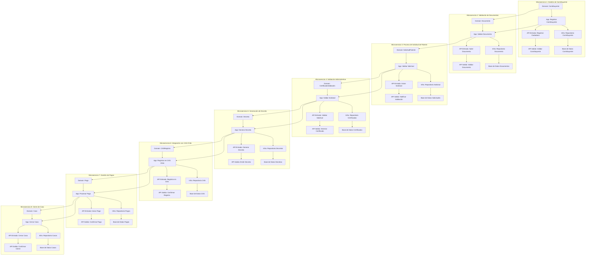

```mermaid
graph TD
    %% Definición de Microservicios y Adaptadores
    subgraph "Microservicio 1: Gestión de Contribuyente"
        direction LR
        A1[Domain: Contribuyente] --> A2[App: Registrar Contribuyente]
        A2 --> A3[Infra: Repositorio Contribuyente]
        A3 --> DB1[Base de Datos Contribuyente]
        A2 --> IA1[API Entrada: Registrar Ciudadano]
        IA1 --> SA1[API Salida: Validar Contribuyente]
    end

    subgraph "Microservicio 2: Validación de Documentos"
        direction LR
        B1[Domain: Documento] --> B2[App: Validar Documento]
        B2 --> B3[Infra: Repositorio Documento]
        B3 --> DB2[Base de Datos Documentos]
        B2 --> IB1[API Entrada: Subir Documento]
        IB1 --> SB1[API Salida: Validar Documento]
    end

    subgraph "Microservicio 3: Proceso de Solicitud de Patente"
        direction LR
        C1[Domain: SolicitudPatente] --> C2[App: Validar Solicitud]
        C2 --> C3[Infra: Repositorio Solicitud]
        C3 --> DB3[Base de Datos Solicitudes]
        C2 --> IC1[API Entrada: Iniciar Solicitud]
        IC1 --> SC1[API Salida: Notificar Validación]
    end

    subgraph "Microservicio 4: Validación Administrativa"
        direction LR
        D1[Domain: CertificadoValidación] --> D2[App: Validar Solicitud]
        D2 --> D3[Infra: Repositorio Certificados]
        D3 --> DB4[Base de Datos Certificados]
        D2 --> ID1[API Entrada: Validar Solicitud]
        ID1 --> SD1[API Salida: Generar Certificado]
    end

    subgraph "Microservicio 5: Generación de Decreto"
        direction LR
        E1[Domain: Decreto] --> E2[App: Generar Decreto]
        E2 --> E3[Infra: Repositorio Decretos]
        E3 --> DB5[Base de Datos Decretos]
        E2 --> IE1[API Entrada: Generar Decreto]
        IE1 --> SE1[API Salida: Emitir Decreto]
    end

    subgraph "Microservicio 6: Integración con CAS Chile"
        direction LR
        F1[Domain: CASRegistro] --> F2[App: Registrar en CAS Chile]
        F2 --> F3[Infra: Repositorio CAS]
        F3 --> DB6[Base de Datos CAS]
        F2 --> IF1[API Entrada: Registrar en CAS]
        IF1 --> SF1[API Salida: Confirmar Registro]
    end

    subgraph "Microservicio 7: Gestión de Pagos"
        direction LR
        G1[Domain: Pago] --> G2[App: Procesar Pago]
        G2 --> G3[Infra: Repositorio Pagos]
        G3 --> DB7[Base de Datos Pagos]
        G2 --> IG1[API Entrada: Iniciar Pago]
        IG1 --> SG1[API Salida: Confirmar Pago]
    end

    subgraph "Microservicio 8: Cierre de Caso"
        direction LR
        H1[Domain: Caso] --> H2[App: Cerrar Caso]
        H2 --> H3[Infra: Repositorio Casos]
        H3 --> DB8[Base de Datos Casos]
        H2 --> IH1[API Entrada: Cerrar Caso]
        IH1 --> SH1[API Salida: Confirmar Cierre]
    end

    %% Relaciones entre Microservicios y Adaptadores
    A2 --> B2
    C2 --> D2
    D2 --> E2
    E2 --> F2
    F2 --> G2
    G2 --> H2

    %% Interacciones entre APIs
    A1 --> B1
    B2 --> C1
    C2 --> D1
    D2 --> E1
    E2 --> F1
    F2 --> G1
    G2 --> H1

```