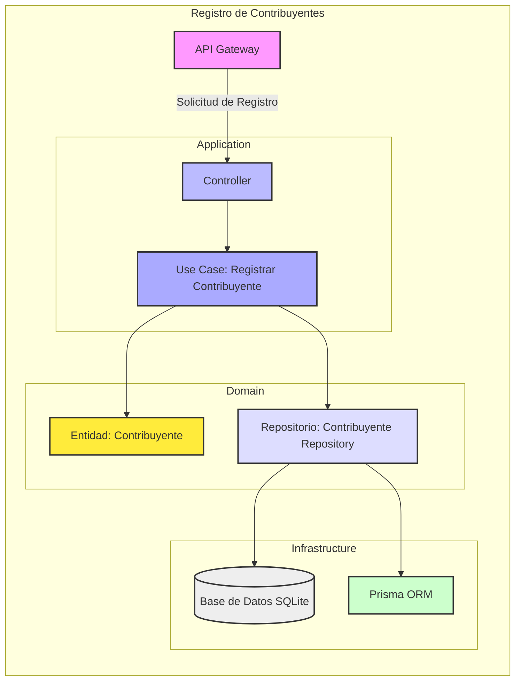
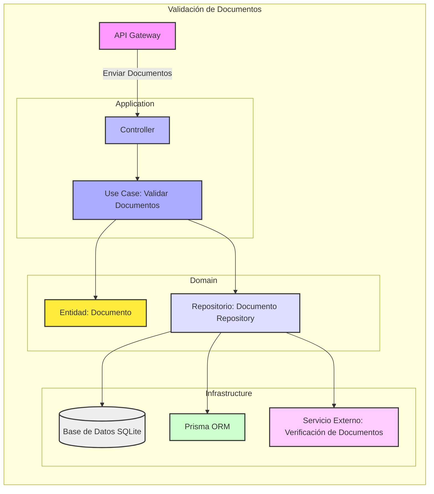
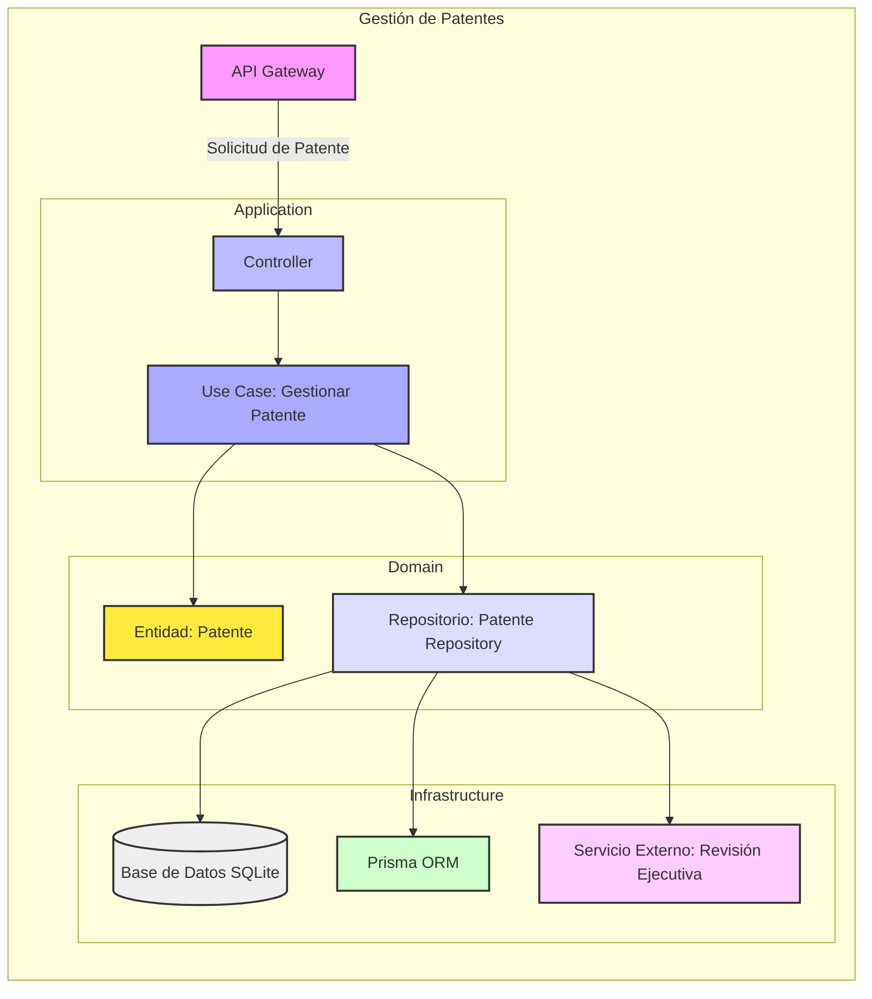
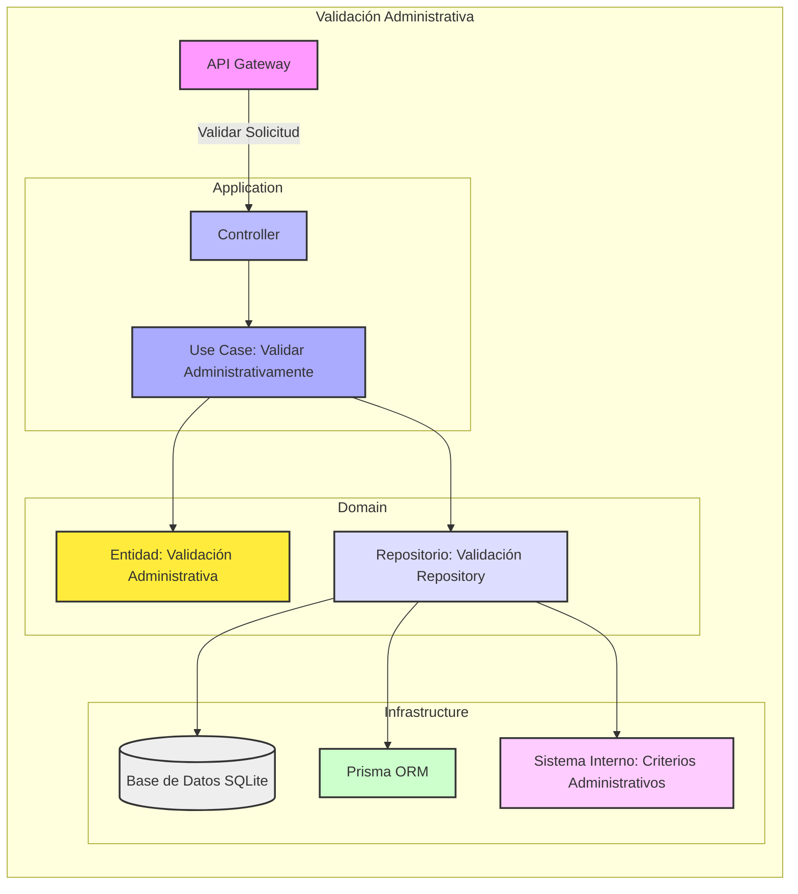
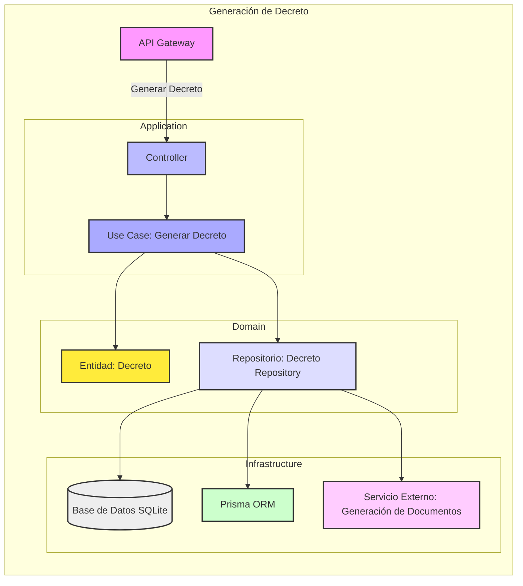
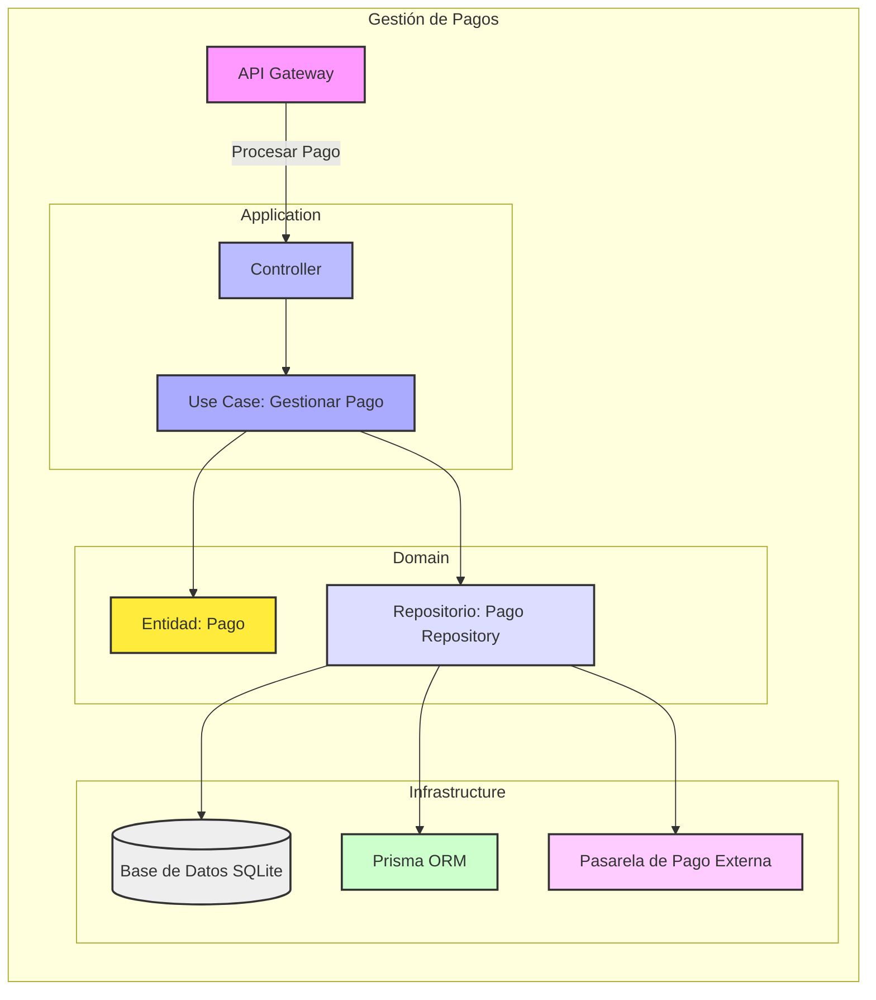
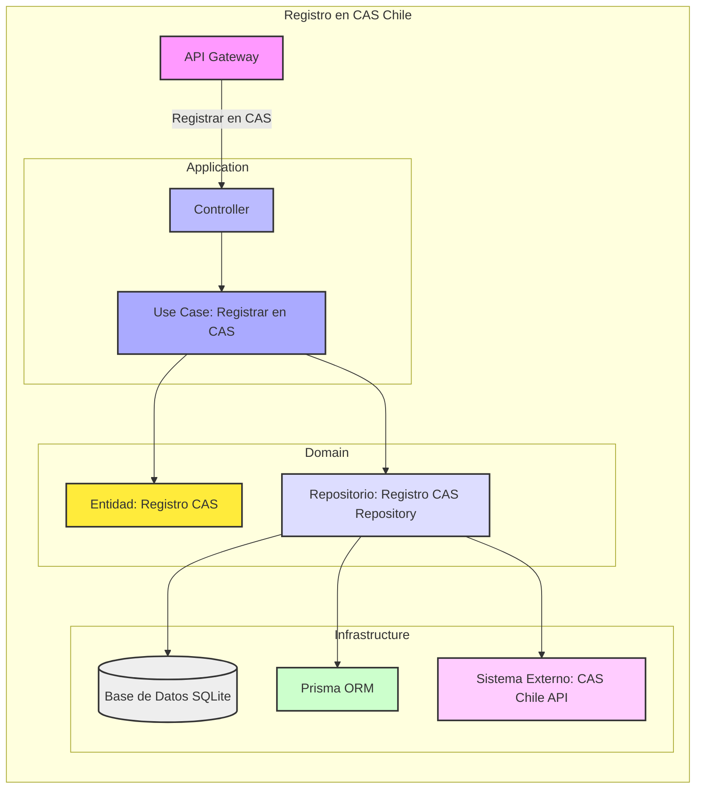
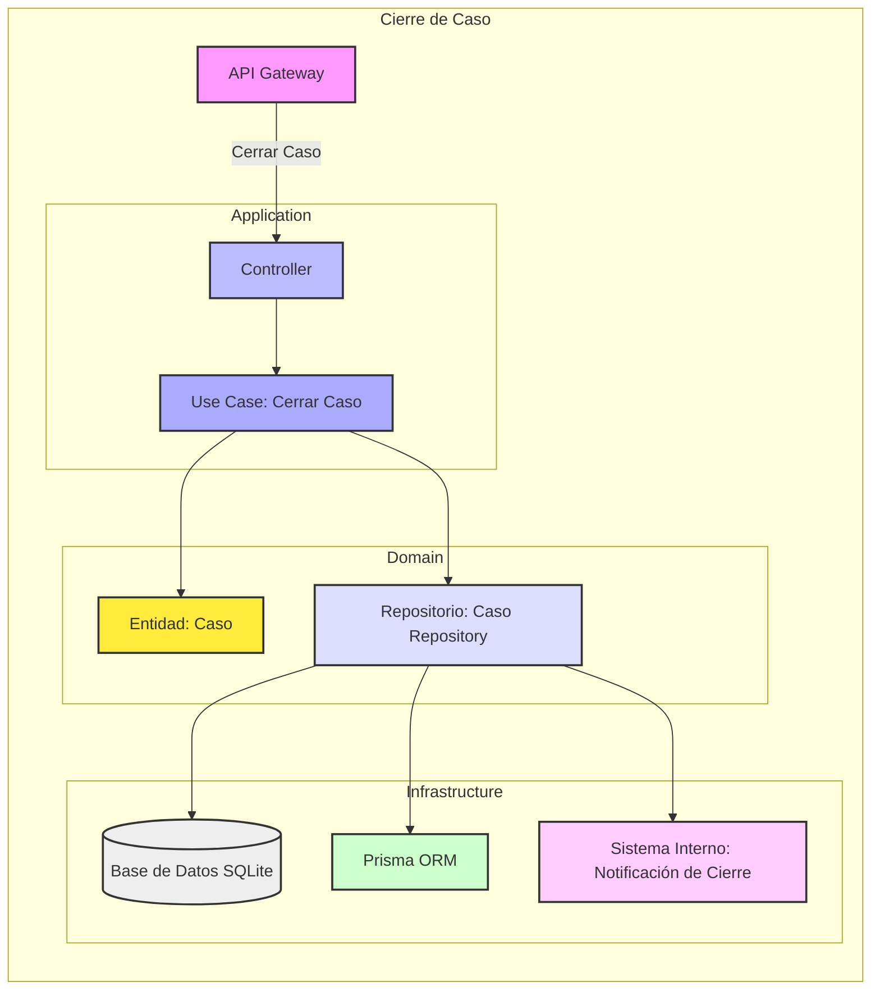
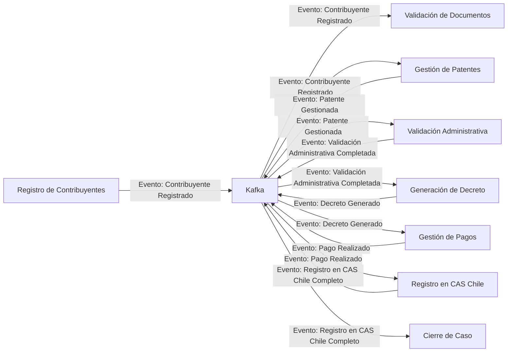

Claro, a continuación se presentan diagramas detallados para cada uno de los ocho microservicios mencionados, utilizando **Mermaid**. Cada diagrama sigue los principios de **Arquitectura Hexagonal**, **Domain-Driven Design (DDD)**, **Screaming Architecture** y **Vertical Slicing**, integrando un **API Gateway** para la comunicación centralizada.

### 1. Microservicio de Registro de Contribuyentes

**Explicación:**
- **API Gateway**: Recibe la solicitud de registro y la dirige al controlador del microservicio.
- **Controller**: Maneja la solicitud y la pasa al caso de uso correspondiente.
- **Use Case**: Implementa la lógica para registrar un contribuyente.
- **Domain**: Contiene la entidad `Contribuyente` y el repositorio para interactuar con la base de datos.
- **Infrastructure**: Utiliza **Prisma ORM** para interactuar con una base de datos **SQLite** independiente.

---

### 2. Microservicio de Validación de Documentos

**Explicación:**
- **API Gateway**: Recibe los documentos para validar y los envía al controlador.
- **Controller**: Gestiona la solicitud de validación y la pasa al caso de uso.
- **Use Case**: Implementa la lógica de validación de documentos.
- **Domain**: Contiene la entidad `Documento` y su repositorio.
- **Infrastructure**: Utiliza **Prisma ORM** con **SQLite** y puede interactuar con servicios externos para la verificación de documentos.

---

### 3. Microservicio de Gestión de Patentes

**Explicación:**
- **API Gateway**: Recibe las solicitudes de gestión de patentes.
- **Controller**: Dirige las solicitudes al caso de uso correspondiente.
- **Use Case**: Maneja todo el proceso de gestión de una patente.
- **Domain**: Define la entidad `Patente` y su repositorio.
- **Infrastructure**: Utiliza **Prisma ORM** con **SQLite** y puede interactuar con servicios ejecutivos para la revisión inicial.

---

### 4. Microservicio de Validación Administrativa

**Explicación:**
- **API Gateway**: Recibe solicitudes para validación administrativa.
- **Controller**: Gestiona y dirige la solicitud al caso de uso.
- **Use Case**: Implementa la lógica de validación según criterios administrativos.
- **Domain**: Define la entidad `Validación Administrativa` y su repositorio.
- **Infrastructure**: Utiliza **Prisma ORM** con **SQLite** y se conecta a sistemas internos que definen los criterios de validación.

---

### 5. Microservicio de Generación de Decreto

**Explicación:**
- **API Gateway**: Recibe solicitudes para la generación de decretos.
- **Controller**: Maneja y dirige la solicitud al caso de uso.
- **Use Case**: Implementa la lógica para generar decretos administrativos.
- **Domain**: Define la entidad `Decreto` y su repositorio.
- **Infrastructure**: Utiliza **Prisma ORM** con **SQLite** y puede interactuar con servicios externos para la generación de documentos legales.

---

### 6. Microservicio de Gestión de Pagos

**Explicación:**
- **API Gateway**: Recibe solicitudes de procesamiento de pagos.
- **Controller**: Gestiona y dirige la solicitud al caso de uso.
- **Use Case**: Implementa la lógica para gestionar transacciones de pago.
- **Domain**: Define la entidad `Pago` y su repositorio.
- **Infrastructure**: Utiliza **Prisma ORM** con **SQLite** y se integra con pasarelas de pago externas para procesar transacciones.

---

### 7. Microservicio de Registro en Sistema CAS Chile

**Explicación:**
- **API Gateway**: Recibe solicitudes para registrar en el sistema CAS Chile.
- **Controller**: Maneja y dirige la solicitud al caso de uso.
- **Use Case**: Implementa la lógica para registrar solicitudes en CAS Chile.
- **Domain**: Define la entidad `Registro CAS` y su repositorio.
- **Infrastructure**: Utiliza **Prisma ORM** con **SQLite** y se integra con la API externa de CAS Chile para el registro.

---

### 8. Microservicio de Cierre de Caso

**Explicación:**
- **API Gateway**: Recibe solicitudes para cerrar un caso.
- **Controller**: Gestiona y dirige la solicitud al caso de uso.
- **Use Case**: Implementa la lógica para cerrar y actualizar el estado final de una solicitud.
- **Domain**: Define la entidad `Caso` y su repositorio.
- **Infrastructure**: Utiliza **Prisma ORM** con **SQLite** y se conecta a sistemas internos para notificar el cierre del caso.

---

### Consideraciones Generales para Todos los Microservicios

1. **Comunicación entre Microservicios**:
    - Utilizan **Kafka** para la mensajería asíncrona, permitiendo la comunicación en tiempo real y desacoplada entre los diferentes servicios.
  
2. **API Gateway**:
    - Centraliza las solicitudes de los clientes y distribuye las solicitudes a los microservicios correspondientes, manejando la autenticación y autorización mediante **JWT** u **OAuth 2.0**.

3. **Arquitectura Hexagonal**:
    - Cada microservicio sigue una arquitectura hexagonal, separando claramente la lógica de negocio (núcleo) de las interfaces externas (adaptadores), facilitando la mantenibilidad y escalabilidad.

4. **Domain-Driven Design (DDD)**:
    - Cada microservicio está orientado a un dominio específico, con entidades y repositorios claramente definidos, promoviendo una alta cohesión y bajo acoplamiento.

5. **Screaming Architecture y Vertical Slicing**:
    - La estructura de cada microservicio refleja claramente su propósito ("screaming architecture") y está organizada en "slices" verticales que abarcan todas las capas necesarias para una funcionalidad completa.

6. **Infraestructura Compartida**:
    - **Prisma ORM** y **SQLite** son utilizados de manera consistente para la gestión de bases de datos dentro de cada microservicio.
    - **Swagger** puede ser implementado en cada microservicio para la documentación de APIs específicas.

7. **Calidad y Despliegue**:
    - **Jest**, **ESLint** y **Prettier** aseguran la calidad del código.
    - **GitHub Actions**, **Docker** y **Kubernetes** facilitan la integración continua y el despliegue eficiente de los microservicios.

### Ejemplo de Comunicación entre Microservicios con Kafka

**Explicación:**
- **Kafka** actúa como el intermediario para la comunicación entre los microservicios, permitiendo que cada servicio reaccione a los eventos relevantes emitidos por otros servicios.
- Este flujo asegura que los microservicios permanezcan desacoplados y puedan escalar de manera independiente.

---

Estos diagramas proporcionan una visión clara y estructurada de cómo cada microservicio está diseñado para cumplir con sus responsabilidades específicas, manteniendo una arquitectura coherente y escalable. Puedes personalizar y expandir estos diagramas según las necesidades específicas de tu proyecto.